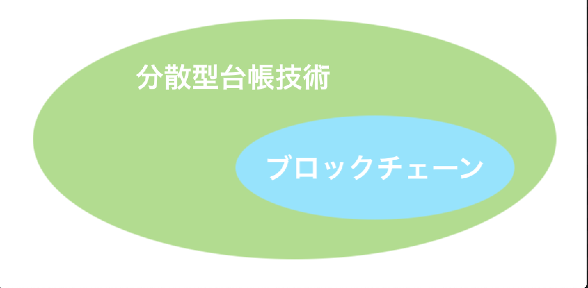

[:contents]

### AWSサービスを理解しよう！

何か久しぶりなような？AWSの製品一覧も日々更新されているようなので、それも見つつ１つ１つ書いて行こうと思います。今回は"ブロックチェーン"です。

### カテゴリ：ブロックチェーン

AWSが提供するブロックチェーンサービスになります。今後なんですが、一度に書く分量も段々と増えて来ていることから前後半と分けて前半は其の物の内容説明、後半はAWSサービスの内容説明として行きたいと思います。今回は前半ということで、プロックチェーン自体についてまとめた内容を書いていこうと思います。では改めて、ブロックチェーンとは何なんでしょう？自分もいまいち分かってないので改めて調べてみました。

### ブロックチェーンとは

取り合えずWikipediaの引用を載せときます。
> ブロックチェーン（英語: Blockchain、ブロックチェインとも）とは、分散型台帳技術、または、分散型ネットワークである。ビットコインの中核技術（サトシ・ナカモトが開発）を原型とするデータベースである。

また、技術的概要でこんなことが書かれています。
> ブロックチェーンは、「ブロック」と呼ばれるデータの単位を生成し、鎖（チェーン）のように連結していくことによりデータを保管するデータベースである。

正直、上の引用だと全然ピンとこなかったので、さらに調べたところ自分の理解は下のような感じでした。

- 分散型台帳技術＝ブロックチェーンではない
- ブロックチェーンは、分散型台帳技術を使った手法の一種
- ブロックチェーンは、データの持ち方としてブロックという単位でデータを持ちチェーンと言われるものでブロックを結んでいるのがブロックチェーンの特徴

文章で書くと分かり辛いので図に頼るとこんな感じです。

データの持ち方部分が、”手法の一種”として細分化されたところなのだと思います。

あとWikipediaの引用には『または、分散型ネットワーク』とありますが、分散型システムのネットワークは分散ネットワークなので紛らわしいからこの文章いらない感じがしました。

ここでは、分散ネットワークの話はちょっと置いといて、分散型台帳技術とブロックチェーンの仕組みの話を記載して本題のAWSサービスの話をして行きたいと思います。

### 分散型台帳技術

Distributed Ledger Technology (DLT)。データを不特定多数の場所で保管し特定の管理者なしに参加する人達が同じデータを共有する、分散して台帳（データ）を管理する技術。台帳と書いてあるのでついつい紙の売り買い帳簿を連想してしまうのですが、台帳＝データですね。もうちょっとイメージしやすいように例を箇条書きしてみました。

- まず、あるルールで定義した台帳((容器は、DBでもNoSQLでもテキストでもOK))を不特定多数の参加者が用意する
- 各参加者が台帳にデータを書き込む
- 各所にある台帳をPeer to Peerネットワークを使い共有

雑な言い方をすると、データを分散して持ちネットワークで共有すれば分散型台帳技術かなと。

### ブロックチェーンの仕組み

『データをブロックという単位に分けてチェーンというもので繋ぐ技術』なんですが、ビットコインを例に少し具体的な内容で理解していこうと思います。

ビットコインは大きく分けて下の３つで構成されています。

- 取引履歴（トランザクション）：ブロック部分
- 前のブロックのハッシュ値
- ナンス値（nonce）((Number used onceの略))

#### ナンス値とは？

また新しい用語が出てきました。これはワンタイムトークンともいうんですが、簡単にいってしまうと”１回限定の使い捨てな値”です。ビットコインの場合は、ブロックが作られるたんびに毎回発行される３２ビットの半角数字となります。

この３つの要素（取引履歴＆前のブロックのハッシュ値＆ナンス値）からそのブロックのハッシュ値が生成され、そのハッシュ値が次のブロックに反映されてチェーンができ上がる。この仕組みがビットコインのブロックチェーンになります。

ビットコインには、もう１つ"マイニング"という重要なワードがあります。

#### マイニングとは？

マイニング（mining）直訳すると**採掘**ですね。この作業をして１番最初に正解にたどり着いた人には報酬が与えられることから、まさにお宝を**採掘**するという作業（処理）になります。具体的にどんなことを行うかを下に書いていきます。

マイニングは、新しくブロックを作成する権利を得るために、１番新しいブロックにあるナンス値がどんな値かを見るける作業になります。マイニングを行う人を**マイナー**と言いますが、**マイナー**はそのブロックのナンス値を世界で１番速く見付けるという作業をし、それが成功したら次の新しいブロックを作成して報酬をもらうという流れになります。

##### ナンス値はどうやって見付ける？

上の"ナンス値とは？"の部分でも書いたんですが、ビットコインは、３つの要素からハッシュ値が生成されます。そのハッシュ値には、"ある条件"があり**マイナー**はその"ある条件"になるようなハッシュ値を生成するためにナンス値をいろいろ組み替え、条件を満たすようなハッシュ値を世界で１番速く生成することができれば、成功となります。では、その”ある”条件"とは何でしょう？

##### "ある条件"＝採掘難易度

採掘難易度（Difficulty）とは、ビットコインの場合は、**ナンスを見付ける難易度**になります。この採掘難易度のアルゴリズムについては、数種類の手法があるようですが、ビットコインでは**POW**というアルゴリズムを使っていてそのアルゴリズムを利用してルールとしてマイニングの作業が１０分に１回成立するような閾値を設けていて、過去２週間の平均グロック生成時間が１０分より長いと閾値を下げて簡単にし、１０分より短ければ閾値を上げて難しくする。という条件になっています。

##### マイニングざっくりまとめ

ざっくりまとめると『マイニングの作業とは、この採掘難易度の閾値より小さい値のハッシュ値を探し出す作業』で、『成功すると報酬がもらえる！』となります。

条件に合うハッシュ値になるまでナンス値を組み換えまくる単純作業をPCは行っているわけです。

### 余談

もっと深掘りしたい人のためにちょっとキーワードを載せておきます。

#### コンセンサスアルゴリズム

上で、採掘難易度のアルゴリズムと書きましたが、正しく表現するとコンセンサスアルゴリズムと言うらしいです。そこでもうちょっと勉強したい人のためにキーワード情報を載せておこうと思います。

Consensus algorithm。直訳すると**合意方法**です。分散型台帳技術などのデータを分散させるような技術は、基本データを管理する管理者がいないため全体のシステムを担保するためそのデータが問題ないか合意を取る仕組みが不可欠になります。

管理者がいて管理者が「OK！」と言えばそれが"正しい行い"とみなされるんですが、この技術では管理者がいないので『これだけやれば、それは"正しい行い"だ！』と立証する方法を編み出した感じです。

手法は複数あるので、代表的なものを記載しておきます。

手法|利用している仮想通貨（抜粋）
-|-
PoW|BTC/BCH/LTCなど
PoS|ETH/ADAなど
PoI|XEMなど
DPoS|LSK/EOSなど
PoC|XRP/ZIPなど

#### 各種ブロックチェーン

ブロックチェーン自体にもいろいろあるみたいです。少し情報を載せておきます。

種類|管理者|代表サービス
-|-|-
パブリックブロックチェーン|なし|Bitcoin
プライベートブロックチェーン|単独組織管理|mijin
コンソーシアムプロックチェーン|複数組織管理|Ripple

### 最後に一言

毎週アップが難しくなりつつある＆ちょっと長ったらしくなって来た感もあるので、今回みたいに切り分けられるところがあれば切り分けてアップしたいと思います。なので、次はブロックチェーン後半です。

それでは、今回はここまで！
